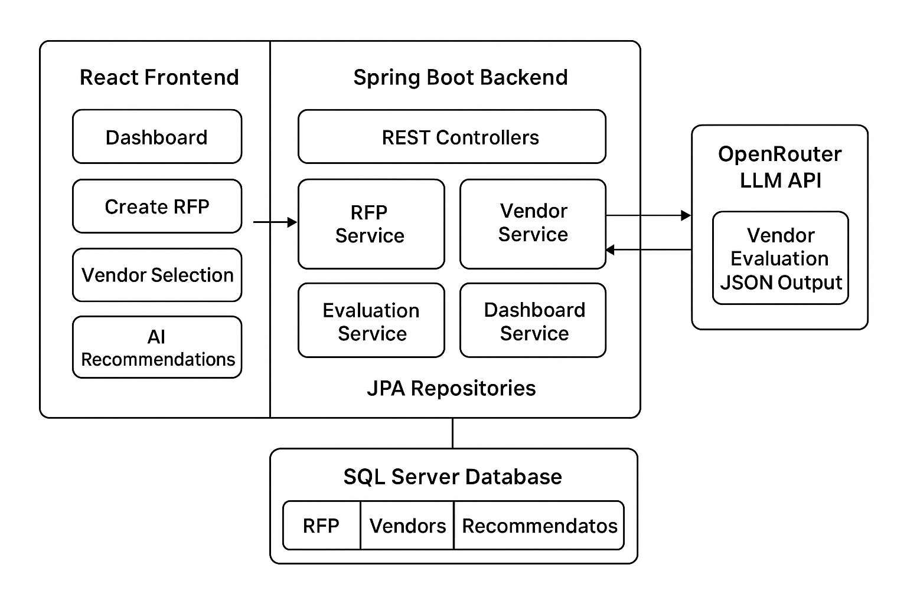

AI-Powered RFP Automation System

A complete end-to-end procurement automation platform built using Spring Boot, React, and AI vendor evaluation.
This project extracts RFPs, sends them to vendors, collects responses, evaluates vendors using AI, and generates recommendations.

Tech Stack

Backend :

Spring Boot 3+

Java 17+

SQL Server

JPA + Hibernate

OpenRouter API (LLM)

JavaMail (IMAP/SMTP)


Frontend :

React + Vite

Axios

React Router


Project Structure
/ai-rfp-system
   ├── backend/   (Spring Boot API, AI evaluation, DB)
   ├── frontend/  (React UI)
   └── README.md  (this file)
   

Features
RFP Extraction

User Prompt → backend extracts title, items, budget, warranty, timeline, payment terms.

Send RFP to Vendors

Select RFP + Vendors → system emails RFP automatically.

Vendor Response Capture

Vendor emails are parsed automatically by IMAP polling.

AI Vendor Evaluation

LLM compares vendor responses and produces:

Ranking

Scores

Strengths & weaknesses

Final recommendation

Summary

Dashboard Shows:

Total RFPs

Sent RFPs

Responses

Vendors

Recent activity


Vendor Management

Add/View vendors with details.


How to Run
Backend
cd backend
./mvnw spring-boot:run

Frontend
cd frontend
npm install
npm run dev

Secrets Management (IMPORTANT)

Store sensitive credentials like:

DB URL

EMAIL SMTP credentials

IMAP configuration

OpenRouter API Key


Architecture Diagram:





```


                        ┌────────────────────────────┐
                        │         FRONTEND            │
                        │        (React App)          │
                        │─────────────────────────────│
                        │  • Dashboard                │
                        │  • Create RFP               │
                        │  • Vendor Selection         │
                        │  • Vendor Responses         │
                        │  • AI Recommendations       │
                        │  • Vendor Management        │
                        └───────────────┬─────────────┘
                                        │ REST API calls (Axios)
                                        ▼
                ┌──────────────────────────────────────────────────┐
                │                   BACKEND (Spring Boot)           │
                │──────────────────────────────────────────────────│
                │  Controllers (API Layer)                         │
                │    • RfpController                               │
                │    • VendorController                            │
                │    • EvaluationController                        │
                │    • DashboardController                         │
                │--------------------------------------------------│
                │  Services (Business Layer)                       │
                │    • RfpService                                  │
                │    • VendorDaoService                            │
                │    • VendorEmailService (SMTP Sender)            │
                │    • ImapPollingService (Email Reader)           │
                │    • VendorEvaluationService (AI Scoring)        │
                │--------------------------------------------------│
                │  Repositories (JPA Layer)                        │
                │    • RfpRepository                               │
                │    • VendorRepository                            │
                │    • VendorSentRecordRepository                  │
                │    • VendorResponseRepository                    │
                │    • RecommendationResultsRepo                   │
                └───────────────┬──────────────────────────────────┘
                                │ Data Persistence
                                ▼
                      ┌──────────────────────┐
                      │     SQL DATABASE     │
                      │    (SQL Server)      │
                      │──────────────────────│
                      │ Tables:              │
                      │  • RFP               │
                      │  • RFP_ITEMS         │
                      │  • VENDORS           │
                      │  • VENDOR_SENT       │
                      │  • VENDOR_RESPONSE   │
                      │  • RECOMMENDATION    │
                      │  • VENDOR_RANKING    │
                      └──────────────────────┘

                                        ▲
                                        │ LLM Prompt
                                        │ + normalized vendor responses
                                        ▼
                       ┌───────────────────────────────────┐
                       │     AI EVALUATION ENGINE (LLM)    │
                       │        OpenRouter API             │
                       │──────────────────────────────────│
                       │ Generates:                        │
                       │  • Vendor rankings                │
                       │  • Scores                         │
                       │  • Strengths & weaknesses         │
                       │  • Final recommendation           │
                       └───────────────────────────────────┘


```


Author:

Srikanth Maram
Full-stack Java + React Developer
RFP Automation Project

